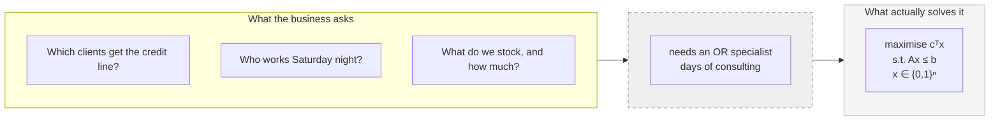
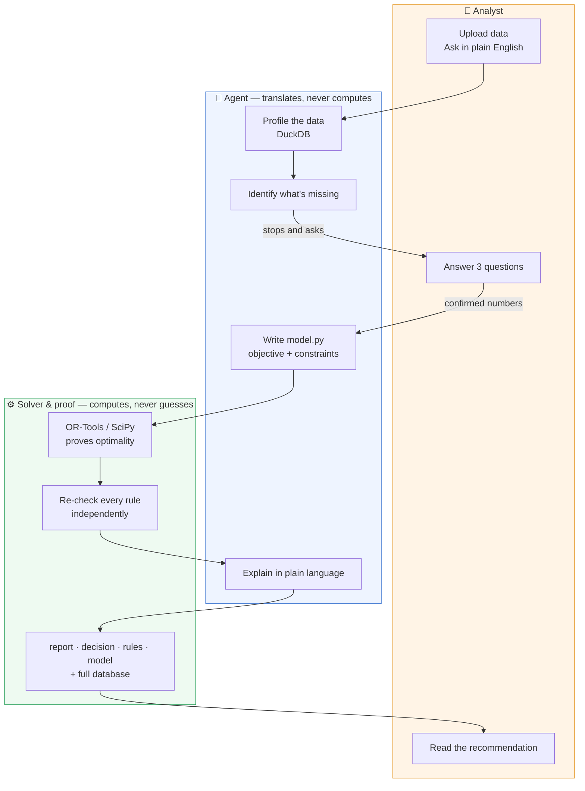
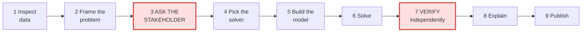
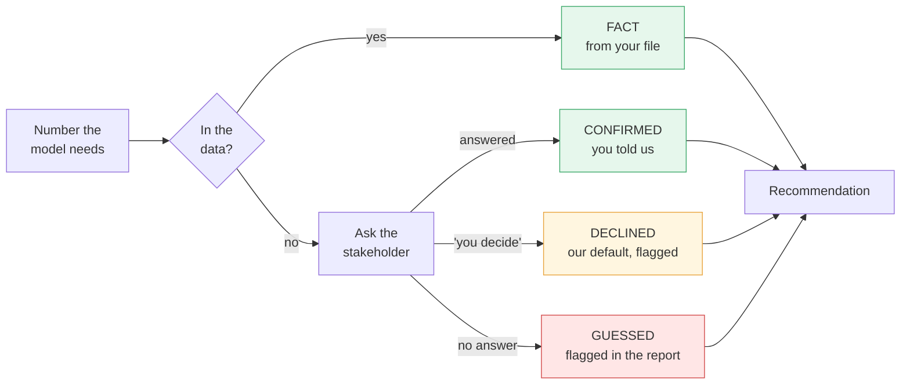
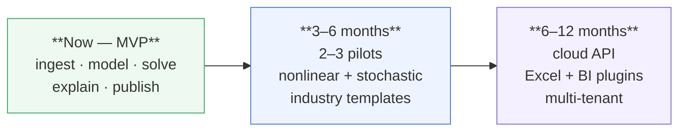

# RiskSense AI — deck review (the reasoning)

Review of `RiskOn_Slides.pptx` (11 slides) against what the two repos actually
do (`riskon-agent`, `riskon-app`). This is the *why*.

**For the slide-by-slide build sheet with the finished images, see
[`SLIDES.md`](SLIDES.md).** The graphics described abstractly below as
"Graphic A", "Graphic B" and so on have all been built and live in
`images/`; `SLIDES.md` maps each one to its slide.

---

## Part 1 — The diagnosis

### 1.1 It reads like a document, not a deck

Current density, measured:

| Slide | Bullets | Words | Longest bullet |
| --- | --- | --- | --- |
| 04 Problem | 3 | 92 | 34 words |
| 05 Solution | 4 | 96 | 27 words |
| 07 Compliance | 3 | 85 | 30 words |
| 08 Impact | 4 | 90 | 26 words |
| 09 Roadmap | 3 | 84 | 30 words |

A jury reads a 30-word bullet in about 8 seconds, during which they are not
listening to you. Six slides in a row of this and you have talked for eight
minutes while nobody heard you.

**Target: max 4 bullets per slide, max 7 words per bullet, one visual per
content slide.** Everything you cut goes into the speaker notes — you still
say it, it just isn't competing with you on screen.

### 1.2 The strongest parts of the product are missing

These are all built and working, and none of them appear on a slide:

| What you built | Where it lives | Why a jury cares |
| --- | --- | --- |
| **The agent stops and asks before modelling** | `ask_stakeholder` MCP tool, `QuestionCard.tsx` | This is the answer to "how do you stop it inventing a budget?" It is the single most differentiated thing in the project. |
| **Assumption ledger: CONFIRMED / DECLINED / GUESSED** | `Workbench.add_assumption()` | A finance jury has seen ten LLM demos today. None of them told the user which numbers were made up. |
| **Independent verification of every constraint** | `ConstraintLog.set_achieved()`, `log.violations()` recomputed in pandas against `source` | You don't trust the solver's own arithmetic. Say that out loud. |
| **The deliverable is a reproducible database** | `workbench.duckdb`, 5 tables | Not "here's an answer" but "here's the answer plus the evidence, re-runnable". |
| **The LLM never computes the answer** | It writes `model.py`; OR-Tools/SciPy proves optimality | The anti-hallucination headline. Slide 05 hints at it but doesn't land it. |
| **Real numbers from real runs** | `runs/20260902-092711-vault-stocking/report.md` | 150k credit line → 78 stones → 123.71 carats, blocked by a 30% cut-grade cap. Concrete beats abstract every time. |

### 1.3 Specific fixes

- **Slide 02 (team)** — two of three names have no description. Fill or cut the
  slide; an empty bullet reads as unpreparedness.
- **Slide 05** — says *Claude Opus 5*. The app's configured default is
  `composer-2.5` (`apps/api/src/config/app-config.ts`). Check which actually
  ran the demo and say that. A jury member who knows the stack will catch this.
- **Slide 05** — says the solver is Google OR-Tools. True for selection and
  assignment; the blend model uses SciPy HiGHS. Say "OR-Tools and SciPy, picked
  per problem type" — it's a stronger claim anyway, it shows you route.
- **Slide 06 (demo)** — currently an empty title. Needs a fallback screenshot
  in case the live demo fails, and a headline result.
- **Slide 03 (agenda)** — eight numbered items. Nobody has ever been persuaded
  by an agenda slide. Keep it if the template mandates it, but make it a
  three-phase visual, not a list of eight.
- **Slide 10 (challenges)** — both bullets are about process. Swap one for a
  technical challenge you actually hit; it reads as more honest engineering.

---

## Part 2 — Slide by slide, with copy

Section numbers 01–08 preserved. 12 slides, ~9 minutes.

### 01 — Title *(unchanged, 15s)*

Add one line under the subtitle:

> **From business question to proven-optimal decision, in minutes.**

---

### 02 — Team *(20s)*

Three photos, three roles, three words each. No sentences.

```
Ali Amjid      — Platform & agent orchestration
Amine Lazrak   — Optimisation modelling
Nina Savas     — Data science, UZH
```

---

### 03 — Agenda *(15s)*

Replace the 8-item list with three phases. Visual: **Graphic C** below.

```
The problem   →   What we built   →   Where it goes
```

---

### 04 — Problem *(60s)*

**Title:** Every business decision is an optimisation problem in disguise

```
• Credit lines. Shift rosters. Inventory routing.
• All the same maths underneath.
• Operations Research solves them exactly.
• Almost nobody can write the model.
```

Visual: **Graphic A** (the gap).

Speaker notes carry the original text: *most real business decisions are
constrained optimization problems in disguise; OR can solve them precisely but
formulating objectives, variables and constraints requires specialist skill
most business teams don't have on hand.*

---

### 05 — Solution: architecture *(75s)*

**Title:** Ask in English. Get a proven-optimal answer.

```
• LLM translates the question into a model.
• Solver proves the answer is optimal.
• The LLM never does the maths.
```

Visual: **Graphic B** (architecture) — this is the money slide, give it room.

---

### 05b — Solution: why you can trust it *(75s)* — **NEW, the important one**

**Title:** Three things that stop it guessing

```
• It asks you before it models.
• Every number is labelled: confirmed or guessed.
• Every rule is re-checked outside the solver.
```

Visual: **Graphic D** (the trust chain) plus a screenshot of `QuestionCard`.

Say out loud: *"When the data has no budget in it, most agents pick one. Ours
stops, asks you, and if you don't answer it labels its own guess in the report
so you can see exactly which numbers are load-bearing."*

---

### 06 — Demo *(2m 30s)*

Put the headline result **on the slide** so it survives a demo failure:

```
Vault stocking · 53,940 stones · 150k credit line
→ 78 stones, 123.71 carats
→ Blocked by: 30% cap on Ideal-cut spend
```

Live path: upload CSV → ask question → **agent asks you three questions** →
answer → results page → Rules tab showing the binding limit.

The Q&A moment is the demo. Make sure it fires.

---

### 07 — Compliance and risk *(45s)*

**Title:** Auditable by construction

```
• No black box — every rule is shown.
• Risk bounds are hard limits, not hints.
• Human signs off before execution.
• Data stays in the session.
```

Visual: screenshot of `constraints.csv` in the Rules tab — rule, allowed, used,
verdict. It makes the claim for you.

---

### 08 — Impact *(45s)*

**Title:** Days of consulting → minutes of self-service

```
• Banks: portfolio and risk allocation.
• Retail, logistics, manufacturing: same maths.
• No in-house OR team required.
```

Visual: **Graphic E** (before/after time bar).

---

### 09 — Roadmap *(45s)*

**Title:** MVP today, product in 6–12 months

```
• Now: ingest → model → solve → explain.
• Next: pilots, nonlinear and stochastic.
• Then: API, Excel and BI plugins.
```

Visual: **Graphic F** (three-lane roadmap).

---

### 10 — Challenges *(30s)*

**Title:** What was hard

```
• Bounding what the agent may decide alone.
• Proving the solver, not trusting it.
• Enough detail on screen, not too much.
```

The middle one is new and worth adding — the verification step exists because
a constraint can be written and never added to the solver, and the result then
looks great. That's a real engineering story.

---

### 11 — Conclusion *(20s)*

```
• Plain-language question in.
• Proven-optimal, explained decision out.
• Every assumption on the record.
```

Closing line, large, centred:

> **From business question to optimal decision — in minutes, not weeks.**

---

## Part 3 — The graphics

Six diagrams. Mermaid source below renders at
[mermaid.live](https://mermaid.live) → export SVG → paste into PowerPoint as a
vector so it stays sharp. Brand colours: keep the existing deck's accent for
the human/decision path, grey for machinery.

### Graphic A — the gap *(slide 04)*

Two columns with a wall between them. Left: three business questions in plain
words. Right: the maths that solves them. The wall is labelled *"needs an OR
specialist"*.



Punchline under it: **RiskSense removes the wall.**

---

### Graphic B — architecture *(slide 05)* — build this one properly

Three horizontal lanes so the human stays visible at the top. This is the
diagram the jury will photograph.



The two labels that carry the whole pitch: **"translates, never computes"** and
**"computes, never guesses"**. Make them big.

---

### Graphic C — the pipeline ribbon *(slide 03 agenda, or 05)*

Nine steps, with the two hard stops marked in a contrasting colour. Shows
process rigour in one glance.



Caption: **Steps 3 and 7 are hard stops. The agent cannot skip them.**

---

### Graphic D — the trust chain *(slide 05b)*

Every number's provenance, end to end. Colour-code the three ledger states.



Caption: **The report always tells you which colour each number is.**

---

### Graphic E — before / after *(slide 08)*

Two horizontal bars, wildly different lengths. Nothing else.

```
Traditional OR engagement  ████████████████████████████  3–10 days
RiskSense AI               ▌                              ~4 minutes
```

Underneath, three small icons: *scoping call · specialist modelling · review
cycle* — all crossed out.

---

### Graphic F — roadmap *(slide 09)*



---

### Screenshots to capture from the running app

Four, all from `ResultsView`. Crop tight, drop shadow, no browser chrome.

| Shot | Where | Slide | Why |
| --- | --- | --- | --- |
| Stakeholder question card | Chat view, `QuestionCard` | 05b | Proves the human-in-the-loop claim visually |
| Rules tab with `LimitBars` | Results → Rules | 07 | Shows a binding limit — auditability made concrete |
| Decision table | Results → Decision | 06 | The actual answer, in business names |
| `model.py` code panel | Results → Model | 07 | "Here is exactly what we solved" |

---

## Part 4 — Execution order

If time is short, do these four and stop:

1. **Graphic B** (architecture) — replaces the weakest slide with the strongest.
2. **Slide 05b** (why you can trust it) — the differentiator, currently absent.
3. **Cut every bullet to 7 words**, move the prose into speaker notes.
4. **Real numbers on slide 06** so the demo can fail without you failing.

Then Graphics A, D, E, F and the screenshots.

### Mechanical checklist

- Body text ≥ 24pt. If it doesn't fit, it isn't a bullet, it's a note.
- One idea per slide. If a slide needs "and", it's two slides.
- No sentence-case paragraphs in bullets — fragments only, no full stops.
- Every content slide gets a visual. A slide of pure text is a slide the jury
  reads instead of listening to you.
- Rehearse against a timer: 9 minutes of speech, 12 slides, ~45s average.
