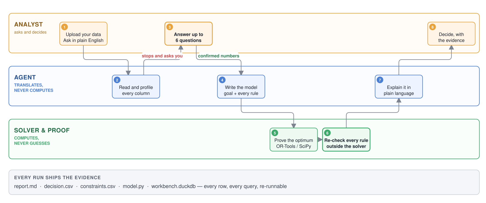
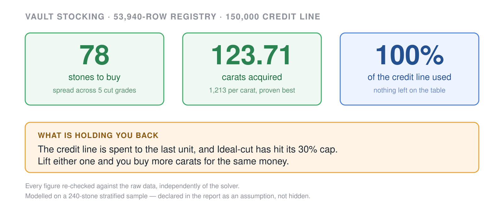
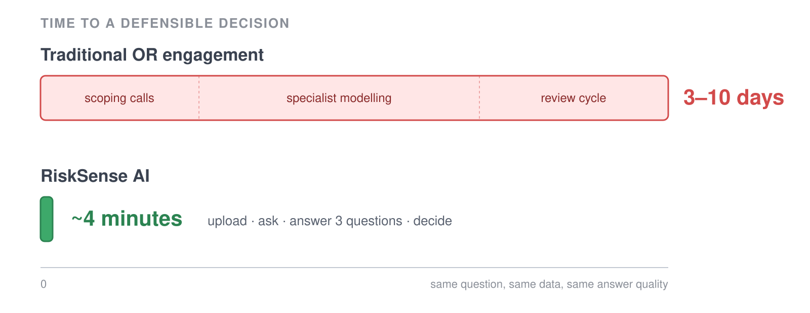

# RiskSense AI — slide-by-slide build sheet

Twelve slides, ~9 minutes. Each slide below gives you the **title**, the
**bullets exactly as they should appear** (nothing longer than 7 words), the
**image to place**, and the **speaker notes** carrying the prose that used to
be on the slide.

All images live in `slides/images/`. Every one exists as both `.svg` (vector —
use this, PowerPoint 2016+ and Keynote both import SVG and it stays sharp at
any projector resolution) and `.png` (fallback, rendered at 2–3×).

Diagram sources are in `slides/mermaid/`. To change a diagram, edit the `.mmd`
and re-run:

```bash
cd slides
npx -y @mermaid-js/mermaid-cli@11 -i mermaid/02-architecture.mmd \
  -o images/02-architecture.png -c mermaid/config.json -b white -s 3
```

`02-architecture.svg`, `05-before-after.svg` and `08-demo-result.svg` are
hand-written SVG, not Mermaid — edit the SVG directly and re-render with
`rsvg-convert -z 2 -b white file.svg -o file.png`.

---

## Slide 1 — Title

**No image.**

```
RiskSense AI

Build an OR Agent — From Business Question to Optimal Decision

From business question to proven-optimal decision, in minutes.

Group 4.3: Amine Lazrak, Ali Amjid, Nina Savas
RiskOn Hackathon, 2 September 2026
```

> **Notes (15s).** Good morning. We're group 4.3 and we built an agent that
> turns a plain-language business question into a mathematically optimal
> decision — with the proof attached.

---

## Slide 2 — Team

**No image** (or three headshots in a row).

```
Ali Amjid       Platform and agent orchestration
Amine Lazrak    Optimisation modelling
Nina Savas      Data science, UZH
```

> **Notes (20s).** Three words each, then move on. Do not read a biography.

⚠️ Two of the three names are blank in the current deck. Fill them or drop the
slide — an empty bullet reads as unpreparedness.

---

## Slide 3 — Agenda


`images/03-pipeline.svg` — nine steps as a thin ribbon, the two hard stops in red.

```
The problem  →  What we built  →  Where it goes
```

> **Notes (15s).** Rather than list eight sections, show them the pipeline once
> and point at the two red boxes: "the agent is not allowed to skip these two."
> Then move on fast. Nobody was ever persuaded by an agenda slide.

---

## Slide 4 — 01 Problem Statement



`images/01-problem-gap.svg`

**Title:** Every business decision is an optimisation problem in disguise

```
• Credit lines. Shift rosters. Inventory.
• Same maths underneath all three.
• Operations Research solves them exactly.
• Almost nobody can write the model.
```

> **Notes (60s).** Most real business decisions — allocating a credit line,
> staffing a shift, routing inventory — are constrained optimisation problems
> in disguise. Operations Research can solve them precisely and provably. But
> formulating the objective, the variables and the constraints takes a
> specialist skill that most business teams simply don't have on hand, and
> hiring it costs days of consulting per question. That gap is our red thread:
> what if any analyst could just ask the question?

---

## Slide 5 — 02 Solution: architecture ★ the money slide



`images/02-architecture.svg` — three-lane swimlane, landscape. Give it the full
slide; put the title small and let the diagram breathe.

**Title:** Ask in English. Get a proven-optimal answer.

```
• The model translates. It never computes.
• The solver computes. It never guesses.
```

> **Notes (75s).** Walk the lanes left to right. Top lane is the human, and
> notice they appear three times, not once. Middle lane is the language model —
> it reads the data, writes the model file, and explains the result. It never
> does the arithmetic. Bottom lane is the solver — OR-Tools or SciPy depending
> on the problem type — which proves the answer is optimal, or proves the
> question is impossible as asked. Point at step 3 and step 6; those are the
> next slide.

**Alternative if the swimlane is too dense for your slide size:**
`images/02b-two-brains.svg` — the same claim, two boxes, much simpler.



---

## Slide 6 — 02 Solution: why you can trust it ★ NEW, the differentiator



`images/04-trust-chain.svg`

**Title:** Three things that stop it guessing

```
• It asks you before it models.
• Every number: confirmed or guessed.
• Every rule re-checked outside the solver.
```

> **Notes (75s).** This is the slide that separates us from every other LLM
> demo today. First: when the data has no budget in it, most agents pick one.
> Ours stops and asks you — up to six plain-language questions, each with a
> recommended answer you can accept with one word. Second: every number that
> didn't come from your file is labelled in the report as confirmed by you,
> defaulted because you said "you decide", or guessed because nobody was there.
> You can always see which numbers are load-bearing. Third: after the solver
> returns, we recompute every single constraint from the raw data, outside the
> solver, and refuse to publish if any of them disagree.

**Add if there's room:** a cropped screenshot of the stakeholder question card
from the app — see the screenshot list at the bottom of this file.

---

## Slide 7 — 03 Demo and Visualisation



`images/08-demo-result.svg` — put this on the slide behind the live demo, so a
demo failure costs you nothing.

**Live demo path (2m 30s):**

1. Upload the diamonds CSV.
2. Ask: *"What should I stock in the vault with a 150,000 credit line?"*
3. **The agent stops and asks three questions** ← this is the demo, make sure it fires
4. Answer them.
5. Results page → Rules tab → point at the binding limit.

> **Notes.** If the live run is slow, talk over it using the numbers on screen.
> The answer is 78 stones, 123.71 carats, the whole credit line spent, and two
> limits binding: the money, and the 30% cap on Ideal-cut. Note the last line —
> we modelled a 240-stone sample, not all 53,940, and the report says so
> without being asked. That's the assumption ledger doing its job.

---

## Slide 8 — 04 Compliance and Risk Considerations



`images/07-deliverables.svg` — or better, a cropped screenshot of the Rules tab
showing rule / allowed / used / verdict.

**Title:** Auditable by construction

```
• No black box — every rule shown.
• Risk bounds are hard limits, not hints.
• A human signs off before execution.
• Client data stays in the session.
```

> **Notes (45s).** Every recommendation ships with the full constraint set and
> a plain-language explanation, so nothing is a black box. Risk-category bounds
> are enforced as hard constraints — the solver cannot return an answer that
> breaks them, it will tell you the question is infeasible instead. Human
> sign-off is required before anything executes. And the whole audit trail is a
> single database file: every row ingested, every query run, every constraint
> checked. An auditor can re-run it.

---

## Slide 9 — 05 Impacts and Benefits



`images/05-before-after.svg`

**Title:** Days of consulting → minutes of self-service

```
• Banks: portfolio and risk allocation.
• Retail, logistics, manufacturing: same maths.
• No in-house OR team needed.
```

> **Notes (45s).** Target audience is portfolio and risk teams at banks, plus
> any asset-heavy business — retailers, manufacturers, logistics — that needs
> constrained allocation without an OR team on staff. The business case is
> three-part: fewer specialist hours, a new decision-support product line, and
> faster decisions that people actually trust because they can see the working.

---

## Slide 10 — 06 Roadmap and Quick-to-Market


`images/06-roadmap.svg`

**Title:** MVP today, product in 6–12 months

```
• Now: ingest, model, solve, explain.
• Next: pilots, nonlinear and stochastic.
• Then: API, Excel and BI plugins.
```

> **Notes (45s).** The MVP already covers the whole path end to end — that's
> what you just saw. Next is two or three pilots with financial and retail
> clients, extending solver coverage to nonlinear and stochastic models, and
> building industry-specific templates. Then cloud API and a plugin path into
> Excel and existing BI tools, so the agent meets people where they already work.

---

## Slide 11 — 07 Challenges Faced

**No image** — or reuse `images/03-pipeline.svg` small, pointing at step 7.

**Title:** What was hard

```
• Bounding what the agent decides alone.
• Proving the solver, not trusting it.
• Enough detail on screen, not too much.
```

> **Notes (30s).** The middle one is the interesting engineering story: a
> constraint can be written in the code and never actually handed to the
> solver, and when that happens the result looks *better*, not broken. That's
> why step 7 exists and why it's a hard stop. Finding the right pipeline — and
> narrowing what the agent is allowed to decide on its own — took most of our
> time. So did making the results page informative without overwhelming anyone.

---

## Slide 12 — 08 Conclusion

**No image.** Big type, lots of white space.

```
• Plain-language question in.
• Proven-optimal, explained decision out.
• Every assumption on the record.
```

Closing line, large and centred:

> **From business question to optimal decision — in minutes, not weeks.**

> **Notes (20s).** Thank you to the jury and the organisers. Happy to take
> questions.

---

## Image inventory

| File | Slide | What it shows |
| --- | --- | --- |
| `images/01-problem-gap.svg` | 4 | Business questions → specialist wall → the maths |
| `images/02-architecture.svg` | 5 | Three-lane swimlane: analyst / agent / solver ★ |
| `images/02b-two-brains.svg` | 5 alt | Simpler two-box version of the same claim |
| `images/03-pipeline.svg` | 3, 11 | Nine steps, two hard stops in red |
| `images/04-trust-chain.svg` | 6 | How every number gets labelled ★ |
| `images/05-before-after.svg` | 9 | 3–10 days vs ~4 minutes |
| `images/06-roadmap.svg` | 10 | Now / 3–6 months / 6–12 months |
| `images/07-deliverables.svg` | 8 | The five files every run ships |
| `images/08-demo-result.svg` | 7 | Real numbers from the vault-stocking run ★ |

★ = the three that do the most selling. If you only place three images, place these.

---

## Screenshots still to capture

Four, from the running app. Crop tight, no browser chrome, add a soft drop
shadow in PowerPoint.

| Shot | Where in the app | Slide | Why it earns its place |
| --- | --- | --- | --- |
| Stakeholder question card | Chat view, agent blocked | 6 | Proves the human-in-the-loop claim visually |
| Rules tab with the limit bars | Results → Rules | 8 | A binding limit, shown not asserted |
| Decision table | Results → Decision | 7 | The actual answer, in business names |
| `model.py` panel | Results → Model | 8 | "Here is exactly what we solved" |

---

## Before you present — checklist

- [ ] **Fix the model name.** Slide 5 of the current deck says *Claude Opus 5*;
      the app's configured default is `composer-2.5` in `app-config.ts`,
      `docker-compose.yml` and `.env.prod.example`. Say whichever actually ran
      the demo.
- [ ] **Fix the solver claim.** It isn't only Google OR-Tools — the blend model
      runs SciPy HiGHS. "OR-Tools and SciPy, routed per problem type" is both
      accurate and a stronger claim, because it shows you select.
- [ ] Fill in the two blank team descriptions.
- [ ] Body text ≥ 24pt everywhere. If it doesn't fit, it's a note, not a bullet.
- [ ] No full stops at the end of bullets; fragments only.
- [ ] Rehearse against a timer. 12 slides, 9 minutes, ~45s average.
- [ ] Have `images/08-demo-result.svg` on screen before you start the live demo.
